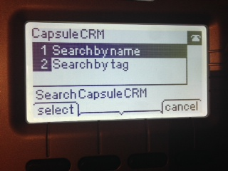

capsulecrm-ciscoipphonedir [](https://travis-ci.org/analytically/capsulecrm-ciscoipphonedir)
==========================

Search [Capsule CRM](http://capsulecrm.com/) from your [Cisco IP phone](http://www.cisco.com/cisco/web/solutions/small_business/products/voice_conferencing/SPA_500/index.html). Uses Capsule CRM [REST API](http://developer.capsulecrm.com/).

Development sponsored by [Coen Recruitment](http://www.coen.co.uk). Follow [@analytically](http://twitter.com/analytically) for updates.





### Functionality

  - Search your contacts (persons and organisations) straight from your phone
  - Search your contacts by tag
  - Saves your last 5 searches (per phone)
  - Pagination through pressing the `next` soft key
  - Built using [spray](http://spray.io/), a [high-performance](http://spray.io/blog/2013-05-24-benchmarking-spray/) REST/HTTP toolkit, should easily support > 1000 connected phones

Planned:

  - Recently modified list
  - Called ID recognition
  - Add note upon incoming call

### Requirements

Java 6 or later. A Capsule CRM account and token.

### Building (optional)

```
sbt assembly
```

This builds a single, executable 'fat' jar in `target/scala-2.10`.

### Running

Capsule CRM users can find their API token by visiting `My Preferences` via their username menu in the Capsule navigation bar.

```
java -Dhostname=capsulecisco.coen.co.uk -Dcapsulecrm.url=https://<yourdomain>.capsulecrm.com -Dcapsulrcrm.token=1234 -jar capsule-cisco.jar
```

Running with [authbind](http://mutelight.org/authbind):

```
authbind --deep java -Dhostname=capsulecisco.coen.co.uk -Dhttp.port=80 -Dcapsulecrm.url=https://<yourdomain>.capsulecrm.com -Dcapsulecrm.token=1234 -Djava.net.preferIPv4Stack -jar capsule-cisco.jar
```

### Cisco IP Phone Setup

  - Go to your phone's `Configuration Utility`
  - Click `Admin login` and `advanced`
  - Go to the `Phone` tab
  - Under `XML Service`, specify where you are running this script (e.g. `http://192.168.0.6/capsule.xml`) and click `Submit All Changes`:


### Tested on

  - [Cisco SPA504G](http://www.cisco.com/en/US/prod/collateral/voicesw/ps6788/phones/ps10499/data_sheet_c78-548564.html)

### License

Licensed under the [Apache License, Version 2.0](http://www.apache.org/licenses/LICENSE-2.0).

Copyright 2013 Coen Recruitment Ltd - www.coen.co.uk.
